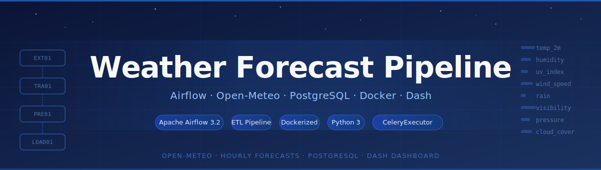

<div align="center">



<br/>

[](https://www.python.org/)
[](https://airflow.apache.org/)
[](https://www.postgresql.org/)
[](https://docs.docker.com/compose/)
[](https://open-meteo.com/)
[](LICENSE)

<br/>

**An automated, Dockerized ETL pipeline that fetches hourly weather forecast data from Open-Meteo, validates and transforms it, diffs it against existing records, and loads it into PostgreSQL — all orchestrated with Apache Airflow 3.2 and visualized with a Dash dashboard.**

</div>

---

## Table of Contents

- [Overview](#-overview)
- [Architecture](#-architecture)
- [Features](#-features)
- [Tech Stack](#-tech-stack)
- [Prerequisites](#-prerequisites)
- [Quick Start](#-quick-start)
- [Project Structure](#-project-structure)
- [Configuration](#-configuration)
- [How It Works](#-how-it-works)
- [Database Schema](#-database-schema)
- [Dashboard](#-dashboard)
- [Useful Commands](#-useful-commands)
- [Contributing](#-contributing)

---

## 🌦 Overview

This project implements a production-style data pipeline that:

1. **Extracts** 7-day hourly weather forecasts from the [Open-Meteo API](https://open-meteo.com/) (free, no key needed)
2. **Transforms** the raw JSON into a clean, typed pandas DataFrame — validating columns, casting types, dropping nulls
3. **Compares** the new batch against what's already in the database, classifying rows as *new*, *existing*, *changed*, or *stale*
4. **Loads** only the new rows into PostgreSQL

Everything runs inside Docker with a single command and is scheduled automatically by Airflow.

---

## 🏗 Architecture

```
Open-Meteo REST API
        │
  ┌─────▼──────┐
  │   EXT01    │  weather_api.py        → GET /v1/forecast, push to XCom
  └─────┬──────┘
        │
  ┌─────▼──────┐
  │   TRA01    │  clean_data.py         → validate, reshape, type-cast
  └─────┬──────┘
        │
  ┌─────▼──────┐
  │  PRELOAD01 │  compare.py            → diff against existing DB rows
  └─────┬──────┘
        │
  ┌─────▼──────┐
  │   LOAD01   │  load.py               → INSERT into weather_forecasts
  └─────┬──────┘
        │
  ┌─────▼──────────────────────┐
  │  PostgreSQL (weather-postgres) │
  └────────────────────────────┘
```

**Service map**

| Service | Role |
|---|---|
| `postgres` | Airflow metadata database |
| `weather-postgres` | Dedicated database for weather data |
| `redis` | Celery message broker |
| `airflow-apiserver` | Web UI + REST API |
| `airflow-scheduler` | Triggers DAG runs on schedule |
| `airflow-dag-processor` | Parses DAG files |
| `airflow-triggerer` | Handles deferred / async tasks |
| `airflow-worker` | Executes task instances (Celery worker) |

---

## ✨ Features

- **Fully containerized** — one `docker compose up -d` starts the entire stack
- **Incremental diffing** — `compare_with_db()` classifies every row before loading so you can see exactly what changed
- **Schema auto-init** — `schema.sql` is idempotent; also applied automatically at runtime if the table is missing
- **Configurable location** — change lat/lon/timezone in `.env`, no code changes needed
- **16 weather variables** — temperature, humidity, rain, UV index, wind, pressure, cloud cover, visibility, sunshine duration, and more
- **Dash dashboard** — interactive charts and stat cards for every tracked location
- **Optional Celery monitor** — enable Flower with `--profile flower`

---

## 🛠 Tech Stack

| Layer | Technology |
|---|---|
| Orchestration | Apache Airflow 3.2 (CeleryExecutor) |
| Data source | Open-Meteo Forecast API |
| Data processing | pandas 2.2, SQLAlchemy 2 |
| Database | PostgreSQL 16 |
| Containerization | Docker Compose |
| Visualization | Dash + Plotly + dash-bootstrap-components |
| Broker | Redis |

---

## 📋 Prerequisites

- [Docker Desktop](https://www.docker.com/products/docker-desktop/) (or Docker Engine + Compose plugin)
- Python 3.10+ (only needed to generate secrets — no local install otherwise)
- 4 GB RAM allocated to Docker (Airflow + Celery worker is the heavy bit)

---

## 🚀 Quick Start

### 1 — Clone the repo

```bash
git clone https://github.com/your-username/weather-forecast-pipeline.git
cd weather-forecast-pipeline
```

### 2 — Generate secrets

Run these once and paste the output into `.env`:

```bash
# Fernet key (Airflow connection encryption)
python -c "from cryptography.fernet import Fernet; print('FERNET_KEY=' + Fernet.generate_key().decode())"

# JWT secret (Airflow API auth)
python -c "import secrets; print('AIRFLOW__API_AUTH__JWT_SECRET=' + secrets.token_hex(32))"
```

Your `.env` should look like:

```env
FERNET_KEY=<paste here>
AIRFLOW__API_AUTH__JWT_SECRET=<paste here>

# Weather database
DB_HOST=weather-postgres
DB_PORT=5432
DB_NAME=weather
DB_USER=admin
DB_PASSWORD=your_secure_password

# Open-Meteo — change lat/lon/timezone to your target location
WEATHER_API_URL=https://api.open-meteo.com/v1/forecast?latitude=27&longitude=30&hourly=temperature_2m,...&timezone=Africa%2FCairo
```

### 3 — Set your user ID (Linux / Mac only)

```bash
echo "AIRFLOW_UID=$(id -u)" >> .env
```

### 4 — Initialize the weather database schema

```bash
docker compose up weather-postgres -d
sleep 5
docker exec -i weather_data_postgres psql -U admin -d weather < src/database/schema.sql
```

### 5 — Start everything

```bash
docker compose up -d
```

> **Windows users:** run `run.bat` instead.

Airflow will initialize its own metadata database and create the admin user automatically (`airflow-init` container runs then exits — that's expected).

### 6 — Open the Airflow UI

```
http://localhost:8080
```

Default credentials: `airflow` / `airflow`

Find **Weather Forecast Pipeline** (`dag01`), toggle it on, then click **Trigger DAG** to run it immediately.

---

## 📁 Project Structure

```
weather-forecast-pipeline/
├── dags/
│   └── dag01.py                  # Airflow DAG definition
├── src/
│   ├── api/
│   │   └── weather_api.py        # Open-Meteo GET request
│   ├── preprocessing/
│   │   └── clean_data.py         # Validation + transformation
│   ├── etl/
│   │   ├── compare.py            # Incremental diff logic
│   │   └── load.py               # PostgreSQL writer
│   └── database/
│       ├── connection.py         # SQLAlchemy engine factory
│       └── schema.sql            # Table + index DDL
├── visualization/
│   └── dashboard.py              # Dash app
├── docker/
│   └── Dockerfile                # Custom Airflow image
├── docker-compose.yaml
├── requirements.txt
├── .env                          # ← create this (see Quick Start)
├── run.bat                       # Windows start script
└── stop.bat                      # Windows stop script
```

---

## ⚙️ Configuration

All runtime config lives in `.env`. The key variables:

| Variable | Description |
|---|---|
| `FERNET_KEY` | Airflow encryption key (generate once) |
| `AIRFLOW__API_AUTH__JWT_SECRET` | Airflow API JWT secret (generate once) |
| `AIRFLOW_UID` | Container user ID (Linux/Mac only) |
| `DB_HOST` | Weather DB host (use `weather-postgres` inside Docker) |
| `DB_PORT` | Weather DB port (default `5432`) |
| `DB_NAME` | Database name (default `weather`) |
| `DB_USER` | Database user |
| `DB_PASSWORD` | Database password |
| `WEATHER_API_URL` | Full Open-Meteo forecast URL including all query params |

To change the forecast location, update `latitude`, `longitude`, and `timezone` inside `WEATHER_API_URL`. No code changes needed.

---

## 🔍 How It Works

### EXT01 — Extract

`weather_api.py::get_weather()` issues a `GET` request to the Open-Meteo endpoint defined in `WEATHER_API_URL` (30 s timeout). On success it pushes the raw JSON payload to Airflow XCom.

### TRA01 — Transform

`clean_data.py::clean_weather()` pulls the raw JSON and:
- Validates that all expected hourly columns are present
- Flattens `hourly.*` arrays into a DataFrame with one row per hour
- Attaches location metadata (`latitude`, `longitude`, `timezone`, `elevation`)
- Casts every column to its target type
- Drops rows where any key field is null

### PRELOAD01 — Compare

`compare.py::compare_with_db()` loads the overlapping time window from the DB and produces a diff report:

| Category | Meaning |
|---|---|
| `new_rows` | In the new batch but not yet in the DB → will be inserted |
| `existing_rows` | Already in the DB with identical values → no action |
| `changed_rows` | Same key, but numeric values drifted beyond 0.05 tolerance |
| `stale_rows` | In the DB but absent from the new batch (forecasts revised away) |

The report is printed to Airflow task logs, and only `df_new` (the insertable rows) is passed to the next task.

### LOAD01 — Load

`load.py::load_data()` writes `df_new` into the `weather_forecasts` table via pandas `to_sql`.

---

## 🗄 Database Schema

```sql
CREATE TABLE IF NOT EXISTS weather_forecasts (
    forecast_id             BIGSERIAL PRIMARY KEY,
    latitude                NUMERIC(8, 5)  NOT NULL,
    longitude               NUMERIC(8, 5)  NOT NULL,
    timezone                VARCHAR(50)    NOT NULL,
    elevation               NUMERIC(5, 1),
    forecast_time           TIMESTAMPTZ    NOT NULL,
    temperature_2m          NUMERIC(4, 1),
    apparent_temperature    NUMERIC(4, 1),
    dew_point_2m            NUMERIC(4, 1),
    relative_humidity_2m    SMALLINT,
    rain                    NUMERIC(5, 2),
    precipitation_probability SMALLINT,
    surface_pressure        NUMERIC(6, 1),
    cloud_cover             SMALLINT,
    visibility              NUMERIC(7, 1),
    uv_index                NUMERIC(3, 1),
    wind_speed_10m          NUMERIC(5, 1),
    wind_direction_10m      SMALLINT,
    wind_gusts_10m          NUMERIC(5, 1),
    sunshine_duration       NUMERIC(6, 1),
    is_day                  BOOLEAN,
    model_used              VARCHAR(50)    DEFAULT 'best_match',
    fetched_at              TIMESTAMPTZ    DEFAULT CURRENT_TIMESTAMP,

    CONSTRAINT unique_lat_lon_time UNIQUE (latitude, longitude, forecast_time)
);

CREATE INDEX IF NOT EXISTS idx_weather_time     ON weather_forecasts (forecast_time DESC);
CREATE INDEX IF NOT EXISTS idx_weather_geo_time ON weather_forecasts (latitude, longitude, forecast_time DESC);
```

---

## 📊 Dashboard

Start the Dash dashboard after the pipeline has run at least once:

```bash
cd visualization
python dashboard.py
```

Then open [http://localhost:8050](http://localhost:8050).

The dashboard shows stat cards and time-series charts for:
- Temperature & apparent temperature
- Relative humidity
- Rain & precipitation probability
- UV index
- Sunshine duration

---

## 🧰 Useful Commands

```bash
# Watch Airflow worker logs live
docker compose logs -f airflow-worker

# Watch scheduler logs
docker compose logs -f airflow-scheduler

# Start the Celery monitor (Flower) at localhost:5555
docker compose --profile flower up -d

# Connect to the weather database directly
docker exec -it weather_data_postgres psql -U admin -d weather

# Run the diff report standalone (outside Airflow)
python -m src.etl.compare

# Full reset — removes all containers and volumes (wipes both databases)
docker compose down -v
```

---

## 🤝 Contributing

1. Fork the repository
2. Create a feature branch: `git checkout -b feature/my-feature`
3. Commit your changes: `git commit -m "feat: add my feature"`
4. Push to the branch: `git push origin feature/my-feature`
5. Open a Pull Request

Please make sure your changes pass a `docker compose up -d` and a manual DAG trigger before submitting.

---

<div align="center">

Built with [Open-Meteo](https://open-meteo.com/) · [Apache Airflow](https://airflow.apache.org/) · [PostgreSQL](https://www.postgresql.org/) · [Dash](https://dash.plotly.com/)

</div>
